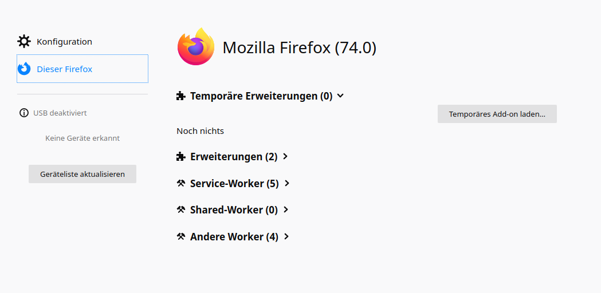

# **Arachnet**

**WORK IN PROGRESS**

This tool will give yo an overview on whats going on if you open a website in your brwoser.
Pictures, Scripts and more are loaded in the background some of them are essential to use the site but others are there to track you. This Add-on shows a list of the called URLs and the type of the called resource.

## Getting Started

To get a copy of the project follow these instructions:

* Clone the project with Git
    * Make sure Git is installed
    * Navigate to your folder of desire 
    * Open your Console and type: `git clone project_url`

### Prerequisites

* Firefox Version >= 74
* JavaScript

### Installing

* Open Firefox
* Type: `about:debugging` in the searchfield
* Then click on "This Firefox" at the left, the following site should appear:

* Click on "Load temporary Add-on"
* Navigate to the folder containing the project
* Select the manifest.json

## Running the tests

After you install the addon as a temporary addon, this button will appear:

If the button appears the addon was succesfully istalled.

## Developing

You can edit the files with an Editor or an IDE of your choice.

## Versioning

I use [GitLab](https://about.gitlab.com/) for versioning.

## Authors

* **Lukas B.** - *Coding* - [DoggoWithHat](https://github.com/Doggo-with-hat)

## Acknowledgments

* Thanks to Lisa H. and Kevin W. for useful hints
* Thanks to our lecturer for the course "Datenschutz und Datensicherheit" [Tobias Reimann](https://www.tobias-reimann.com/)
* Open Source icons by [pixelperfect](https://www.flaticon.com/de/kostenloses-icon/open-source_888868)
